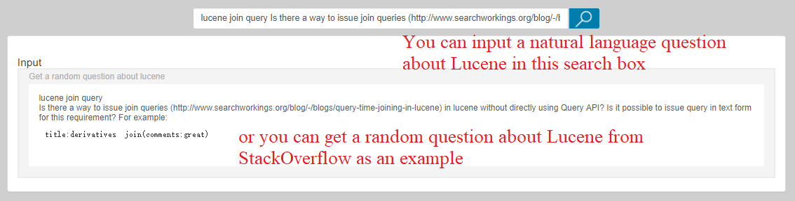
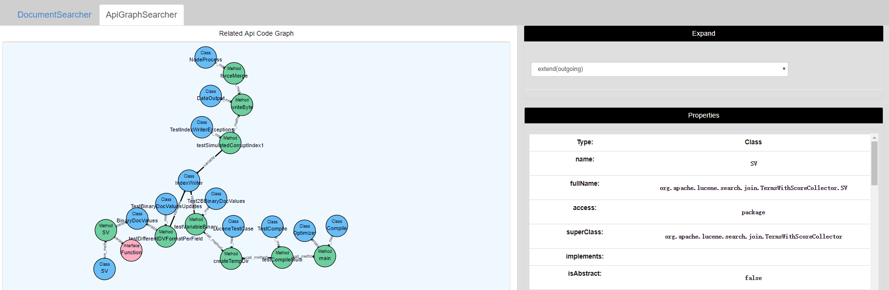
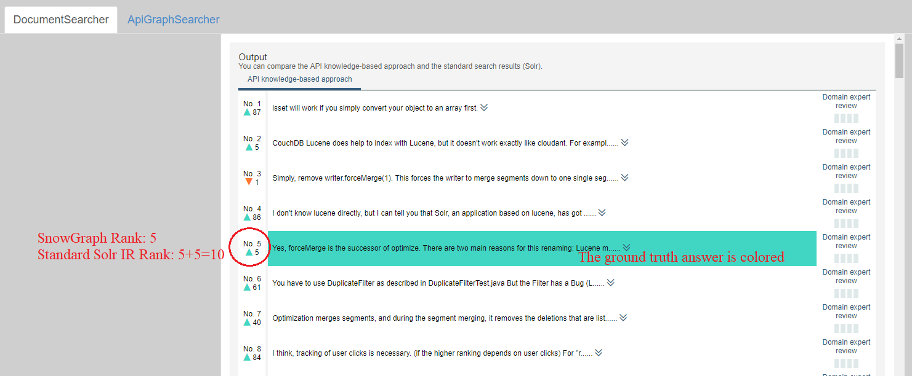

# [](#header-1)Background

A software project usually has lots of various software engineering data, such as source code, documentation, bug reports, mailing lists, user forums, etc.
These software engineering data contain rich software-specific knowledge that can be leveraged to help software developers reuse the software project.
However, it is a difficult task for software developers to obtain knowledge from large-scale software engineering data for two reasons:

* Software engineering data are usually multi-source and heterogeneous. The problem of information island arises, and we don't know relationships between them.
* Natural language text is a common form of knowledge representation in software engineering data, while the machine comprehension of natural language text is very difficult.

# [](#header-1)Introduction

SnowGraph (Software Knowledge Graph) is a project for creating software-specific question-answering bot.
Given a software project and various software engineering data of it, you can use SnowGraph to:

* **Creating a software-specific knowledge graph automatically.** SnowGraph will extract entities from software engineering data, analyze relationships between them, and fuse them into a uniform graph database. Software developers can access the software-specific knowledge graph through graphic user interface or graph query language.
* **Creating a software-specific question answering bot automatically.** Given a natural language user question about the software project, the QA bot can return passages from software engineering data to answer the question.

# [](#header-1)Demo

[This is an online SnowGraph demo for helping software developers reuse Apache Lucene](http://162.105.88.28:8080/SnowGraph/index.html)

(Temporarily suspended from 2017-9-30 to 2017-10-27 to celebrate the 19th National Congress of CPC.)

* **Input**

    You can input a natural language question about Lucene in the search box.
    
    For the convenience of demonstration, we add a "get-random-question" link in this demo.
    Click this link, then the site will get a random question about Lucene from StackOverflow as an example input.
    
    

* **Knowledge Graph Navigation**

    Given the natural language user question, our site will locate related code elements about the question, and discover structural dependencies between these code elements.
    This is an API subgraph about the question, as the following figure shows.

    

    You can use the API subgraph as a starting point to navigate the knowledge graph of Lucene.
    Double-click an entity, then the "properties" panel will show its properties.
    If you want to see some neighbors of the entity, select a relationship type in the "expand" panel and double-click the entity again, then these neighbors will be shown in the "related API graph" panel.

* **Question Answering**

    Given the natural language user question, our site will search passages from documents in Lucene (including emails, bug reports, API documentation, StackOverflow answers, etc) to answer the question.

    

    We leverage conceptual knowledge in Lucene's source code to improve the rank of these passages.
    In our experimental evaluation, SnowGraph ranks ground truth answers of test StackOverflow questions much higher than several state-of-the-art document ranking approaches, including Solr, LDA and neural language models.

# [](#header-1)Installation

* **Dependencies**

    1. JRE (>=1.8)
    2. Apache Tomcat
    3. Neo4j (3.2.0)
    4. Solr (>=7.0.1)

    Download resources:

    ```
Netdisk-address：http://pan.baidu.com/s/1kV6745x
Password：qnyj
```

* **Demo Deployment**

    1. Download demo data (*graphdb-lucene.zip*, *solr-lucene.zip*, *qaexample-lucene*) from the above netdisk-address;
    2. unzip *solr-lucene.zip* and move directory *myCore* to *{solr-home}/server/solr/*;
    3. run ```./{solr-home}/bin/solr start```;
    4. unzip graphdb-lucene.zip and copy the directory *graphdb-lucene* to *graphdb-lucene-copy*;
    5. Open Neo4j desktop client, *Options... --> Database Configuration, Edit*, comment this line:
        *dbms.security.auth_enabled=true*
    6. Use Neo4j desktop client to run database *graphdb-lucene-copy*;
    7. Edit *WEB-INF/classes/conf* in *SnowGraph.war*:

        ```
db {graphdb-lucene address}
neo4jUrl http://127.0.0.1:7474
exampleFilePath {qaexample-lucene address}
solrUrl http://127.0.0.1:8983/solr
```

    8. Deploy *SnowGraph.war* in Apache Tomcat and start Tomcat server;
    9. Visit SnowGraph demo in *localhost:8080/SnowGraph/index.html*
    
* **Install SnowGraph for Your Own Software Project**

//TODO

# [](#header-1)Reference

* **Project Background**

    Intelligent Development Environment and Software Knowledge Graph [[PDF]](assets/papers/intellide.pdf)
```
@article{lin2017intelligent,
  title={Intelligent Development Environment and Software Knowledge Graph},
  author={Lin, Ze-Qi and Xie, Bing and Zou, Yan-Zhen and Zhao, Jun-Feng and Li, Xuan-Dong and Wei, Jun and Sun, Hai-Long and Yin, Gang},
  journal={Journal of Computer Science and Technology},
  volume={32},
  number={2},
  pages={242--249},
  year={2017},
  publisher={Springer}
}
```

* **Question Answering Approach**

    Improving Software Text Retrieval using Conceptual Knowledge in Source Code [[PDF]](assets/papers/embedding.pdf)
```
@inproceedings{lin2017improving,
  title={Improving Software Text Retrieval using Conceptual Knowledge in Source Code},
  author={Lin, Zeqi and Zou, Yanzhen and Zhao, Junfeng and Bing, Xie},
  booktitle={Automated Software Engineering (ASE), 2017 32th IEEE/ACM International Conference on},
  year={2017},
  organization={IEEE}
}
```

# [](#header-1)People

//TODO
